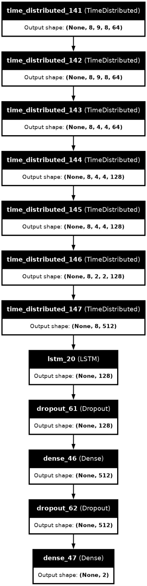
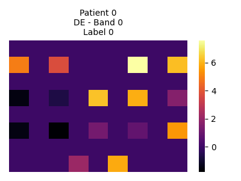
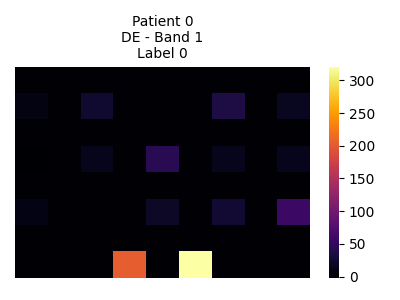
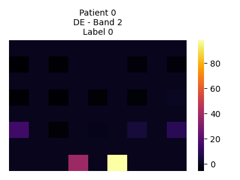
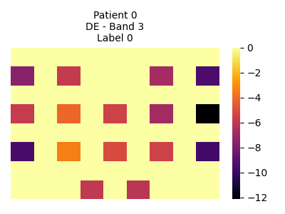
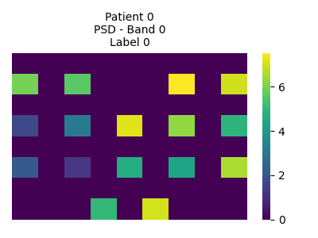
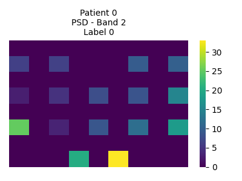
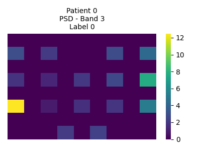

# Schizophrenia EEG Classification Using EEG Brain Signals

A novel deep learning approach to classify Schizophrenia using EEG (electroencephalography) brain signals with LSTM and Dense neural networks.

## 📋 Status

**Finished** - Schizophrenia EEG Classification Project

## 🎯 Project Overview

This project implements a sequential neural network model using TimeDistributed LSTM layers combined with Dense layers to classify EEG signals into two categories:

- **Class 0**: Control (Non-Schizophrenia)
- **Class 1**: Schizophrenia

The model uses temporal feature extraction from EEG data for binary classification with high accuracy.

## 📁 Project Structure
```
Schizophrenia_EEG/
├── notebooks/
│   └── schizophrenia-v2.ipynb                  # Main project notebook
├── modules/
│   ├── augmentation.py                         # ✅ Data augmentation module
│   ├── data_loading.py                         # ✅ Data loading utilities
│   ├── evaluate.py                             # ✅ Model evaluation functions
│   ├── feature_extraction.py                   # ✅ Feature extraction module
│   └── training.py                             # ✅ Model training module
├── references/
│   ├── Input Data Representation.ipynb         # Reference notebook
│   ├── Training.ipynb                          # Reference notebook
│   ├── eegemotion/                             # Reference materials
│   └── graphics/
│       └── brainmaps.png                       # EEG channel layout reference
├── sample_images/
│   ├── de/                                     # Differential Entropy samples
│   │   ├── band_0/patient_0.png
│   │   ├── band_1/patient_0.png
│   │   ├── band_2/patient_0.png
│   │   └── band_3/patient_0.png
│   ├── psd/                                    # Power Spectral Density samples
│   │   ├── band_0/patient_0.png
│   │   ├── band_1/patient_0.png
│   │   ├── band_2/patient_0.png
│   │   └── band_3/patient_0.png
│   └── se/                                     # Spectral Entropy samples
│       ├── band_0/patient_0.png
│       ├── band_1/patient_0.png
│       ├── band_2/patient_0.png
│       └── band_3/patient_0.png
├── results/
│   └── confusion_matrix_schizophrenia.png      # Model performance results
├── graphics/
│   ├── brainmaps.png                           # EEG electrode positions
│   └── model_architecture_timedistributed.png  # Model architecture diagram
├── README.md
├── LICENSE
├── requirements.txt
└── setup.py
```

## 🧠 EEG Channel Reference


*Reference visualization of EEG electrode positions and channel arrangement*

## 🏗️ Model Architecture



*Deep learning model using TimeDistributed LSTM layers with temporal feature extraction*

## 📊 Sample Visualizations

### Differential Entropy (DE) Features
These heatmaps show the Differential Entropy values across EEG channels for each frequency band:

#### Band 0 (Delta: 1-4 Hz)


#### Band 1 (Theta: 4-8 Hz)


#### Band 2 (Alpha: 8-13 Hz)


#### Band 3 (Beta: 13-30 Hz)


### Power Spectral Density (PSD) Features
These heatmaps represent the power spectrum across different frequency bands:

#### Band 0 (Delta: 1-4 Hz)


#### Band 1 (Theta: 4-8 Hz)


#### Band 2 (Alpha: 8-13 Hz)


#### Band 3 (Beta: 13-30 Hz)


## 🎯 Model Results

### Confusion Matrix


*Classification performance metrics showing true positives, true negatives, false positives, and false negatives*

## 🚀 Getting Started

### Prerequisites
- Python 3.7+
- TensorFlow/Keras
- NumPy
- Pandas
- Scikit-learn
- Matplotlib
- Scipy

### Installation
```bash
# Clone the repository
git clone https://github.com/ans036/Schizophrenia_EEG.git
cd Schizophrenia_EEG

# Install dependencies
pip install -r requirements.txt
```

### Usage

1. **Data Preparation**:
```python
   from modules.data_loading import load_eeg_data
   data = load_eeg_data('path_to_eeg_files')
```

2. **Feature Extraction**:
```python
   from modules.feature_extraction import extract_features
   features = extract_features(data)
```

3. **Data Augmentation** (optional):
```python
   from modules.augmentation import augment_data
   augmented_features = augment_data(features)
```

4. **Model Training**:
```python
   from modules.training import train_model
   model = train_model(features, labels)
```

5. **Model Evaluation**:
```python
   from modules.evaluate import evaluate_model
   results = evaluate_model(model, test_data, test_labels)
```

## 📚 Key Features

✅ **TimeDistributed LSTM**: Processes temporal patterns in EEG data  
✅ **Multiple Feature Extraction**: Differential Entropy, Power Spectral Density, Spectral Entropy  
✅ **Data Augmentation**: Increases training dataset diversity  
✅ **Modular Architecture**: Easy to understand and extend  
✅ **Comprehensive Evaluation**: Detailed performance metrics and visualizations  

## 📖 References

- EEG Emotion Recognition Dataset: [eegemotion/](references/eegemotion/)
- Input Data Representation: [Input Data Representation.ipynb](references/Input%20Data%20Representation.ipynb)
- Training Details: [Training.ipynb](references/Training.ipynb)

## 📄 License

This project is licensed under the MIT License - see the [LICENSE](LICENSE) file for details.

## 👤 Author

**Anish** - [GitHub Profile](https://github.com/ans036)

## 🤝 Contributing

Contributions are welcome! Please feel free to submit a Pull Request.

## 📧 Contact

For questions or suggestions, please email ani.tubai022@gmail.com or open an issue on the GitHub repository.


---

**Last Updated**: 2026  
**Status**: Development Finished
